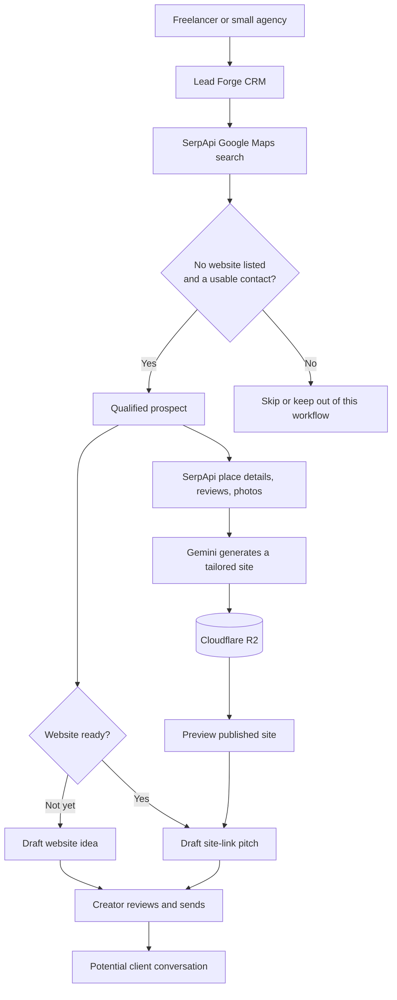

# Lead Forge

### SerpApi-powered prospecting for India's next generation of web creators.

**Turn a Google Maps search into a qualified lead, a custom website, and a ready-to-review WhatsApp introduction.**

Lead Forge helps freelancers and small agencies find local businesses that may need a website, build one for them, and start a direct conversation. SerpApi is at the heart of the workflow: it turns local Google Maps searches into structured business leads and supplies the business context for each generated site.

> **The opportunity:** make it easier for independent web creators to find nearby businesses, show them what a professional web presence could look like, and build a sustainable client pipeline.

## The SerpApi-powered workflow


## Why this matters in India

India has a large, diverse base of micro and small businesses, spread across cities, towns, and business categories. Finding a promising local prospect one at a time is slow; searching by service and location gives freelancers a practical way to build a focused pipeline. The Ministry of MSME's annual reports provide useful context on the sector, while the ASUSE survey tracks India's unincorporated non-farm enterprises.

For many local businesses, a mobile number is a practical first contact. WhatsApp's documented click-to-chat feature makes that contact path familiar and low-friction: Lead Forge keeps outreach available for every lead with a valid Indian mobile number, whether or not a site has been generated. Before generation, it drafts a website introduction; after publication, it pitches the preview link. **It does not send messages automatically.** The freelancer reviews the message and chooses whether to send it; a phone number is not proof that the business uses WhatsApp or wants to be contacted.

That creates a simple opportunity for independent web creators: use local search to discover prospects, invest in a tailored sample site, and offer website creation or related services directly. Lead Forge helps with prospecting and preparation; client interest and revenue depend on the freelancer's offer and follow-up.

### Research and product references

- [SerpApi Google Maps API](https://serpapi.com/google-maps-api) — structured local business search by query and location.
- [SerpApi Google Maps Place Results](https://serpapi.com/maps-place-results) — business details for enriching a prospect.
- [SerpApi Google Maps Reviews API](https://serpapi.com/google-maps-reviews-api) and [Photos API](https://serpapi.com/google-maps-photos-api) — reviews and imagery used to personalize generated sites.
- [Ministry of MSME annual reports](https://msme.gov.in/annual-report-2023-24) and [MoSPI's ASUSE survey](https://mospi.gov.in/annual-reports) — official context on India's MSME and unincorporated-enterprise landscape.
- [WhatsApp: How to use click to chat](https://faq.whatsapp.com/5913398998672934/) — explains the user-initiated chat-link pattern used for outreach.

## What makes Lead Forge useful

- **Discover with SerpApi:** search Google Maps businesses by category and location instead of building a prospect list by hand.
- **Qualify for the India-first workflow:** prioritize businesses with no website shown on their listing and a valid Indian mobile number; email-only contacts can also qualify.
- **Keep the pipeline organized:** search, filter, sort, update lead status, and review activity in the CRM.
- **Build with real business context:** use SerpApi place details, highly rated reviews, and available photos to inform Gemini website generation.
- **Outreach at any stage:** open a prefilled WhatsApp message for any lead with a valid Indian mobile number; pitch the website idea before generation or the preview link after publication.

## Product flow at a glance



*“No website” means no website was shown in the Google Maps listing returned for the search; verify the business before making an offer.*

## Run locally

The Cloudflare Worker is the deployed app. Use Node.js 22 or newer:

```powershell
npm ci
Copy-Item .dev.vars.example .dev.vars
# Add your service API keys to .dev.vars
npm run db:migrate:local
npm run dev
```

Open the local URL printed by Wrangler. Keep real API keys in `.dev.vars`; never commit them.

The repository also includes a separate Python/FastAPI development backend:

```powershell
python -m venv .venv
.\.venv\Scripts\Activate.ps1
pip install -r requirements.txt
Copy-Item .env.example .env
# Add the required service credentials to .env
uvicorn app.main:app --reload
```

Open <http://localhost:8000>. For Cloudflare resources, required credentials, and production deployment, see [DEPLOYMENT.md](./DEPLOYMENT.md).

## Project map

| File or folder | One-line explanation |
|---|---|
| `static/` | The CRM interface used by creators. |
| `src/worker.js` | Serves the Cloudflare app, API, and published websites. |
| `src/api.js` | Handles lead search, CRM actions, and API requests. |
| `src/db.js` | Stores and retrieves app data in Cloudflare D1. |
| `src/site-generation.js` | Enriches leads and runs queued website-generation jobs. |
| `app/` | Contains the separate Python/FastAPI development backend. |
| `migrations/` | Defines versioned database changes. |
| `wrangler.toml` | Configures Cloudflare resources and local Worker development. |
| `DEPLOYMENT.md` | Explains Cloudflare setup and deployment. |

## Commands

| Command | What it does |
|---|---|
| `npm run dev` | Starts the local Cloudflare Worker. |
| `npm test` | Runs the Node.js test suite. |
| `npm run db:migrate:local` | Applies migrations to the local D1 database. |
| `npm run deploy` | Deploys the Worker to Cloudflare. |
